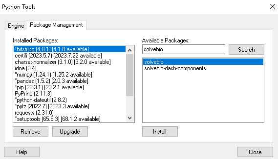
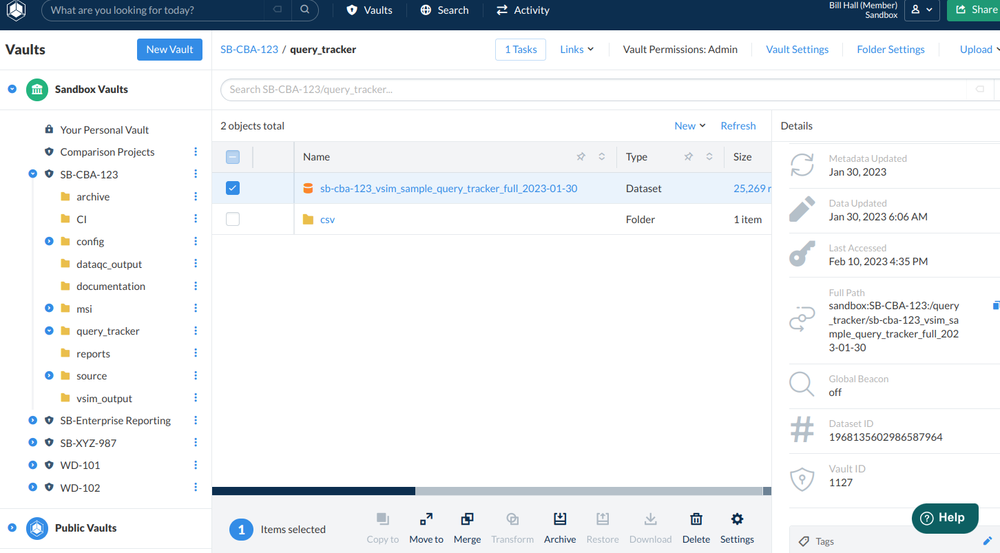

# Integrating a Client Hosted Spotfire with your QuartzBio Environments

## Introduction

Utilizing the native API capabilities of the QuartzBio platform, a client-managed Spotfire instance can gain access to both the raw source vendor data that is the input to the QuartzBio Platform as well as the curated / normalized data that is the output of the data management capabilities of the QuartzBio Platform.

This guide will help you set up your secure access to these APIs as well as set up the Spotfire configurations needed to bring the data sources into your Spotfire environment.

## Step-By-Step Instructions

### Step 1: Setup QuartzBio API Credentials

Follow the [Python API instructions here](https://quartzbio.freshdesk.com/support/solutions/articles/73000603089-python-authentication) to generate your personal access token.

### Step 2: Add the quartzbio and pandas Python Packages to Spotfire

- Login as an Admin of your Spotfire instance.
- Go to **Tools / Python Tools**.
- Type `quartzbio` in the search and then install the package.
- Type `pandas` in the search and then install the package.



### Step 3: Register the Data Function in Spotfire

- Login as an Admin of your Spotfire instance.
- Go to **Tools / Register Data Functions** and create a function with the following settings:
  - **Name**: `QuartzBio EDP Data Retriever`
  - **Type**: Python script
  - **Packages**: `quartzbio;pandas;spotfire;json`
  - **Description**: Data retriever function to access data in the QuartzBio platform

**Script**:

```Python
import quartzbio
import pandas as pd
import spotfire
import json

quartzbio.login(access_token=access_token, api_host=api_host)

data_set = quartzbio.Dataset.get_by_full_path(data_path)
field_info = data_set.fields()
returned_data_set = data_set.query()

pd_field_list = {}
sf_field_list = {}

pd_data_type_map = {
    "string":"object",
    "text":"object",
    "auto":"object",
    "integer":"int64",
    "long":"int64",
    "double":"float64",
    "float":"float64",
    "boolean":"bool",
    "date":"datetime64"
}

sf_data_type_map = {
    "string":"String",
    "text":"String",
    "auto":"String",
    "integer":"Integer",
    "long":"LongInteger",
    "double":"Real",
    "float":"Real",
    "boolean":"Boolean",
    "date":"DateTime"
}

for field in field_info:
    pd_field_list[field.name]=pd.Series(dtype=pd_data_type_map.get(field.data_type,"object"))
    sf_field_list[field.name]=sf_data_type_map.get(field.data_type,"String")

qb_data_set = pd.DataFrame(returned_data_set, columns = pd_field_list)
spotfire.set_spotfire_types(qb_data_set, sf_field_list)
```

**Parameters**:

- **Input Parameters**
  - `access_token` – String – Required
  - `api_host` – String – Required
  - `data_path` – String – Required
- **Output Parameters**
  - `qb_data_set` – Table

Save the Data Function to a folder with the permissions needed to give access to those in your organization that you would like to be able to use the function to pull in new datasets.

### Step 4: Importing a dataset

First, gather your inputs:

- **ACCESS TOKEN**: From Step 1 above.
- **API HOST**:
  - Login to your QuartzBio EDP instance by going to `app.quartz.bio` and then choosing **Launch** next to your EDP instance.
  - Take the part of the URL up to the first forward slash. You will need to add `.api` prior to the `.edp.aws.quartz.bio`.
  - Example:
    - URL after login: `https://sandbox.edp.aws.quartz.bio`
    - API URL: `sandbox.api.edp.aws.quartz.bio`
- **EDP Data Path**:
  - Within the EDP instance, navigate to a vault and find the dataset you would like to import.
  - Single click the row of the dataset and copy the full path from the **Details** on the right pane.
  - Example: `sandbox:SB-CBA-123:/query_tracker/sb-cba-123_vsim_sample_query_tracker_full_2023-01-30`



Then import the dataset:

1. Open the Spotfire Library to the location that you saved the Data Function.
2. Double click on the data function to bring up the input parameters screen.
3. Input the parameters as described above and click **OK**.
4. Edit the name of the new data table and click **OK**.
