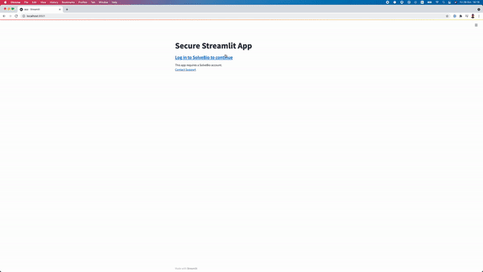

## QuartzBio Login for Streamlit Apps

This module provides OAuth2-based login support for Streamlit apps.

About Streamlit: [https://streamlit.io/](https://streamlit.io/)


### Securing Streamlit app

Create a new app in QuartzBio RUO and copy app's client id and secret to .env file.

`QuartzBioStreamlit` class is used to wrap Streamlit apps with QuartzBio OAuth2. Once the user is successfully authenticated, OAuth2 `token` and the initialised `SolveClient` are saved to the Streamlit's session state. You can access them:
```python
st.session_state.quartzbio_client
st.session_state.token
```

Wrapping Streamlit app:

```python
def streamlit_demo_app():
    # Getting the sovle client from the Streamlit session state
    quartzbio_client = st.session_state.quartzbio_client
    user = quartzbio_client.User.retrieve()

    st.title("QuartzBio app")
    st.header(f"Welcome back {user['first_name']}!")

# Wrapping Streamlit app with QuartzBio OAuth2
secure_app = QuartzBioStreamlit()
secure_app.wrap(streamlit_app=streamlit_demo_app)
```


### QuartzBio secure Streamlit app demo

To run streamlit demo app:
```bash
streamlit run app.py
```

